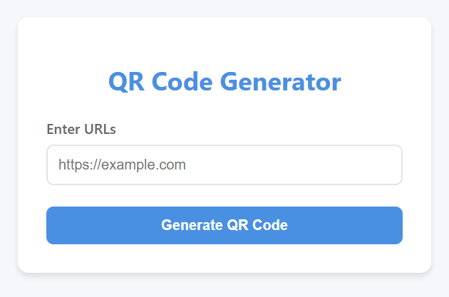

## QR Code Generator App

A production-ready **Flask-based REST API** that generates QR codes for validated URLs.  
The application includes **input validation**, **rate limiting**, **automated testing**, **Dockerization**, and **CI safeguards** to ensure reliability and safe deployment.

---
### Live Demo
**Production URL (Render):**  
👉 https://qr-code-generator-xn0j.onrender.com

---
### Screenshots
#### Home Page


#### Generated QR Code


---
### Features
- Generate QR codes for valid URLs
- Strong request and URL validation
- Rate limiting to prevent abuse
- Stateless QR generation (no files written to disk)
- Automated tests with `pytest`
- Dockerized for consistent builds
- CI enforcement to block deployments on test failures
- Production deployment on **Render**
---
### Tech Stack

| Layer | Technology |
|-----|-----------|
| Backend | Python, Flask |
| Validation | Custom validators |
| Rate Limiting | Flask-Limiter |
| QR Generation | qrcode, Pillow |
| Testing | Pytest |
| Containerization | Docker |
| CI/CD | GitHub Actions |
| Hosting | Render |

---
### API Endpoint

#### Generate QR Code

**Endpoint**
```http
POST /generate
```

**Headers**
```http
Content-Type: application/json
```

**Request Body**
```json
{
  "url": "https://example.com"
}
```

**Successful Response**

- HTTP Status: 200 OK
- Returns a QR code image (PNG)

**Error Responses**
| Status Code | Reason                 |
| ----------- | ---------------------- |
| 400         | Invalid or missing URL |
| 429         | Rate limit exceeded    |
| 500         | Internal server error  |

---
### Input Validation
The API validates:
- Request body must be JSON
- url field must exist
- URL must be properly formatted
- Empty or malformed values are rejected

Validation errors return:
```json
{
  "error": "Invalid URL"
}
```
---
### Rate Limiting
Rate limiting is enforced to prevent misuse.
Example configuration:
- **10 requests per minute per IP**
When exceeded:
```http
HTTP/1.1 429 Too Many Requests
```
This protects the service from brute-force or automated abuse.

---
### Project Structure
```text
qr-code-generator/
│
├── app.py
├── requirements.txt
├── Dockerfile
├── .dockerignore
│
├── tests/
│   ├── __init__.py
│   └── test_validation.py
│
├── docs/
│   └── screenshots/
│
└── .github/
    └── workflows/
        └── deploy.yml
```
---
### Local Setup
**1. Clone the Repository**
```bash
git clone https://github.com/your-username/qr-code-generator.git
cd qr-code-generator
```
**2. Create Virtual Environment**
```bash
python -m venv venv
```
Activate:
- Windows:
```bash
venv\Scripts\activate
```
- macOS/Linux:
```bash
source venv/bin/activate
```
**3. Install Dependencies**
```bash
pip install -r requirements.txt
```
---
### Running the App Locally
```bash
python app.py
```
The API will be available at:
```arduino
http://localhost:5000
```
---
### Running Tests
```bash
pytest
```
- Tests validate request payloads and error handling
- CI fails if any test fails
---
### Docker Support
**Build Image**
```bash
docker build -t qr-code-generator .
```
**Run Container**
```bash
docker run -p 5000:5000 qr-code-generator
```
---
### Python Version Compatibility
- Local development: Python 3.10
- Docker image: Python 3.10-slim
This is acceptable because Python maintains backward compatibility across minor versions.
---
### Continuous Integration (CI)
GitHub Actions ensures:
- Tests run on every push
- Deployment is blocked if tests fail
---
### CI Behavior
- If pytest fails → deployment stops
- Ensures only tested code reaches production
---
### Deployment
The application is deployed on Render using Docker.
Deployment pipeline:
1. Push code to GitHub
2. CI runs tests
3. Deployment proceeds only if tests pass
4. Render builds and deploys the container

Known Limitations
- No HTTPS enforcement at application level (Handled by Render)
- No monitoring or logging stack configured yet
---
### Future Improvements
- HTTPS enforcement middleware
- Centralized logging (e.g., Loguru + Render logs)
- Monitoring and alerting
- QR expiration using time-based tokens
- Authentication for private QR generation
---
### License
This project is for Learning and demonstration purposes.
